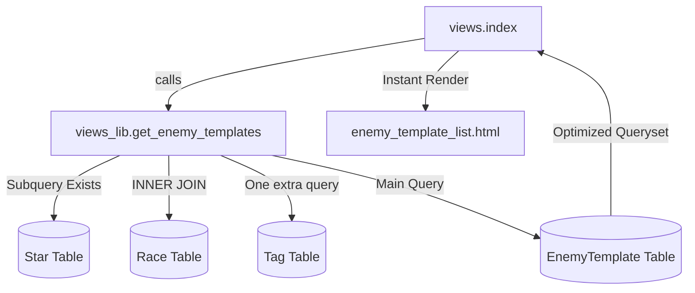

# Requirements

### Overview & Goals
The enemy list view (`/enemies/`) is currently very slow when handling a large number of templates (e.g., 10,000) because it triggers an **N+1 query problem**. For each template, the system executes separate queries for tags, owner, race, and star status, resulting in tens of thousands of database hits.

The goal is to implement an incremental, backend-only optimization to reduce these hits to a constant number (O(1)) without changing the UI or breaking client-side search.

### Scope
- **In Scope**:
    - Optimization of `EnemyTemplate` and `Star` model methods.
    - Refactoring `get_enemy_templates` in `views_lib.py` to use advanced Django ORM features (Joining, Prefetching, Annotations).
    - Performance verification using production-scale data.
- **Out of Scope**:
    - Front-end changes (UI/UX remains identical).
    - Server-side pagination.

# Technical Design

### Current Implementation
The view logic in `views_lib.py` fetches templates and then iterates through them in a Python loop to set the `starred` attribute. Additionally, the template rendering triggers `get_tags()` and accesses related `race`/`owner` objects, each causing a new database query.

### Proposed Changes

#### 1. Batch-Friendly Models (`enemygen/models.py`)
- Change `get_tags` to use `self.tags.all()`. This allows Django to satisfy the request from the prefetch cache.
- Update `is_starred` to check for `hasattr(self, 'starred')` before querying.

#### 2. Consolidated Query Logic (`enemygen/views_lib.py`)
- Instead of building a list and extending it, we will build a single `QuerySet`.
- **Joins**: Use `select_related('race', 'owner')` to fetch related objects in the same SQL statement.
- **Prefetching**: Use `prefetch_related('tags')` to fetch all tags for all templates in a single separate query.
- **Annotations**: Use `Exists` subqueries to determine if a user has starred a template directly in the main SQL query.

### File Structure
- `enemygen/models.py`: Update `EnemyTemplate` methods.
- `enemygen/views_lib.py`: Refactor `get_enemy_templates` and `get_starred`.

### Architecture Diagram

# Testing

### Validation Approach
I will use the `dev_tools/count_rows.py` to confirm the database scale and then use Django's connection logging or a simple timer to measure the speed of `get_enemy_templates`.

### Key Scenarios
- **Anonymous User**: Ensure tags and related data load fast, and stars are all "empty".
- **Logged-in User**: Ensure stars accurately reflect the user's data and load instantly.
- **Production Scale**: Verify the list with ~10,000 templates loads in under 500ms (backend time).

### Regression Testing
- Run `python3 manage.py test` to ensure model changes haven't broken generation logic or admin views.

# Delivery Steps

### ✓ Step 1: Stage 1: Optimize model methods for batch processing
Update the `EnemyTemplate` and `Star` models to support efficient batch fetching.

- Modify `EnemyTemplate.get_tags` in `enemygen/models.py` to use `self.tags.all()` instead of `self.tags.names()`, allowing it to use prefetched data.
- Update `EnemyTemplate.is_starred` to check for a pre-populated `starred` attribute on the instance before querying the database.
- Update `EnemyTemplate.get_starred` class method to include `select_related('template', 'template__race', 'template__owner')` and `prefetch_related('template__tags')`.
- Run unit tests to ensure no regressions in basic functionality.

### ✓ Step 2: Stage 2: Consolidate template query in views_lib
Consolidate the main template fetching logic in `enemygen/views_lib.py`.

- Update `get_enemy_templates` to use a single `QuerySet` instead of extending lists.
- Use `Q` objects to combine published and user-owned templates in one query.
- Apply `select_related('race', 'owner')` and `prefetch_related('tags')` to the queryset.
- Ensure the result set maintains the existing ordering (published first, then user's private templates, both by rank).

### * Step 3: Stage 3: Implement database-level Star annotation
Move the Star status check from a Python loop into the database query.

- Update `get_enemy_templates` to use `annotate(starred=Exists(...))` for authenticated users.
- Remove the manual `for` loop that calls `is_starred` for every template.
- Verify that the star icons still render correctly for both logged-in and anonymous users.

###   Step 4: Stage 4: Verification and performance testing with large dataset
Verify the performance gains using the production-scale dataset.

- Import the large `local_dump.sql` into the SQLite environment (if not already done).
- Measure the number of database queries and execution time for the `/enemies/` page with ~10,000 templates.
- Compare the optimized result against the baseline performance.