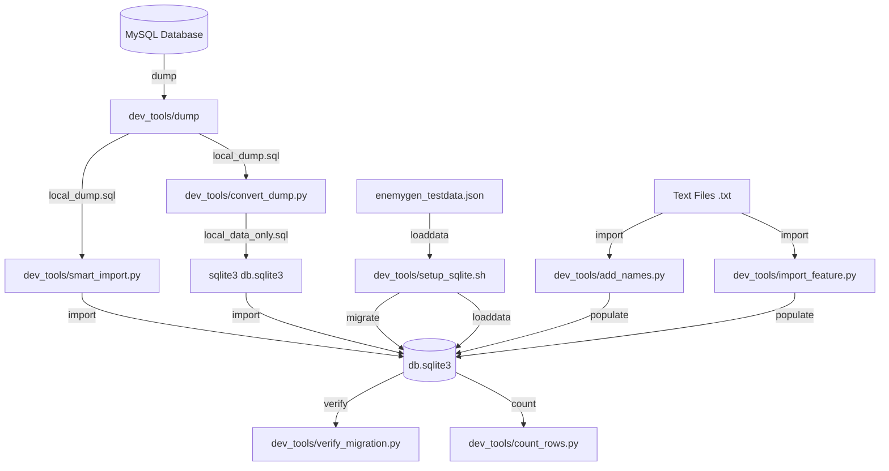

# SQLite Development Quick Start

Follow these steps to run the Mythras Encounter Generator locally using SQLite.

### Automated Setup
The easiest way to set up the environment is to use the provided setup script.

```bash
# Make the script executable
chmod +x dev_tools/setup_sqlite.sh

# Run the setup
./dev_tools/setup_sqlite.sh
```

---

### Manual Setup
If you prefer to perform the steps manually, follow these instructions:

### 1. Preparation
Ensure you have Python 3.11+ and a virtual environment active.

```bash
# Create the temporary directory for generated files
mkdir temp

# Install dependencies
pip install -r requirements.txt
```

**Example Output:**
```text
$ mkdir temp
$ pip install -r requirements.txt
Collecting ...
...
Successfully installed Django-3.2.25 ...
```

### 2. Configure Settings
Update `mythras_eg/settings.py` to use SQLite. You can replace the `DATABASES` block with:

```python
DATABASES = {
    'default': {
        'ENGINE': 'django.db.backends.sqlite3',
        'NAME': os.path.join(PROJECT_ROOT, 'db.sqlite3'),
    }
}
```

Ensure `STATICFILES_DIRS` and `TEMP` are also correctly set (they are by default in `settings_example.py`).

### 3. Initialize Database
You can either initialize a clean database with minimal test data or import production data from a MySQL dump.

#### Option A: Clean Database (Test Data)
```bash
# Apply migrations to create the database schema
python3 manage.py migrate

# Load initial test data (races, spells, templates, etc.)
python3 manage.py loaddata enemygen_testdata.json
```

**Example Output:**
```text
$ python3 manage.py migrate
Operations to perform:
  Apply all migrations: admin, auth, contenttypes, django_registration, enemygen, sessions, taggit
Running migrations:
  Applying contenttypes.0001_initial... OK
  Applying auth.0001_initial... OK
  ...

$ python3 manage.py loaddata enemygen_testdata.json
Installed 1998 object(s) from 1 fixture(s)
```

#### Option B: Import Production Data (MySQL Dump)
If you have a `local_dump.sql` file in MySQL format (usually generated by `dev_tools/dump`), you can import it into SQLite using the `smart_import.py` script. This script automatically maps columns and handles MySQL-to-SQLite data conversion.

```bash
# 1. First, ensure the SQLite schema is created
python3 manage.py migrate

# 2. Run the import script (expects local_dump.sql in dev_tools and db.sqlite3 to exist)
python3 dev_tools/smart_import.py

# 3. Synchronize migration history
# Since the dump may not contain django_migrations, you must fake the migrations
# to tell Django that the tables already exist.
python3 manage.py migrate --fake-initial
python3 manage.py migrate --fake

# 4. (Optional) Verify the migration
python3 dev_tools/verify_migration.py
```

**Example Output:**
```text
$ python3 dev_tools/smart_import.py
Importing block for auth_user...
Importing block for enemygen_enemytemplate...
...
Done!

$ python3 manage.py migrate --fake
Operations to perform:
  Apply all migrations: admin, auth, contenttypes, enemygen, sessions, taggit
Running migrations:
  Applying contenttypes.0001_initial... FAKED
  ...
```

### 4. Run Server
```bash
python3 manage.py runserver
```

**Example Output:**
```text
$ python3 manage.py runserver
Watching for file changes with StatReloader
Performing system checks...

System check identified no issues (0 silenced).
August 15, 2026 - 19:15:23
Django version 3.2.25, using settings 'mythras_eg.settings'
Starting development server at http://127.0.0.1:8000/
Quit the server with CONTROL-C.
```
Access the app at http://127.0.0.1:8000/

### 5. Run Tests
```bash
python3 manage.py test
```

**Example Output:**
```text
$ python3 manage.py test
Found 23 test(s).
Creating test database for alias 'default'...
System check identified no issues (0 silenced).
.......................
----------------------------------------------------------------------
Ran 23 tests in 1.226s

OK
Destroying test database for alias 'default'...
```

---

### Development Tools & Workflow

The `dev_tools/` directory contains several scripts to manage the SQLite environment and data lifecycle.

#### Tool Relationship Diagram



#### Tool Summary

| Tool | Purpose | Input | Output |
| :--- | :--- | :--- | :--- |
| `setup_sqlite.sh` | Automated environment setup | `requirements.txt`, `enemygen_testdata.json` | `db.sqlite3`, `settings.py`, `temp/` |
| `dump` | Create MySQL data dump | MySQL 'mythras_eg' database | `local_dump.sql` |
| `smart_import.py` | Intelligent data migration | `local_dump.sql`, `db.sqlite3` | Populated `db.sqlite3` |
| `convert_dump.py` | MySQL to SQLite SQL converter | `local_dump.sql` | `local_data_only.sql` |
| `verify_migration.py` | Data integrity check | `db.sqlite3` | Console report |
| `count_rows.py` | Database scale summary | `db.sqlite3` | Console row counts |
| `add_names.py` | Bulk name import | `.txt` file | `AdditionalFeatureItem` entries |
| `import_feature.py` | Bulk feature/item import | `.txt` file | `AdditionalFeatureList/Item` entries |

---

### Switching between MySQL and SQLite
MySQL is the primary and default database engine for Mythras Encounter Generator. SQLite is provided as an alternative to simplify local development and testing.

#### To use MySQL (Default):
Ensure your `mythras_eg/settings.py` contains the MySQL configuration (as seen in `settings_example.py`):

```python
DATABASES = {
    'default': {
        'ENGINE': 'django.db.backends.mysql',
        'NAME': 'enemygen',
        'USER': 'your_user',
        'PASSWORD': 'your_password',
        'HOST': 'localhost',
        'PORT': '3306',
    }
}
```

#### To use SQLite:
Modify the `DATABASES` block in `mythras_eg/settings.py` to point to the SQLite engine:

```python
DATABASES = {
    'default': {
        'ENGINE': 'django.db.backends.sqlite3',
        'NAME': os.path.join(PROJECT_ROOT, 'db.sqlite3'),
    }
}
```
